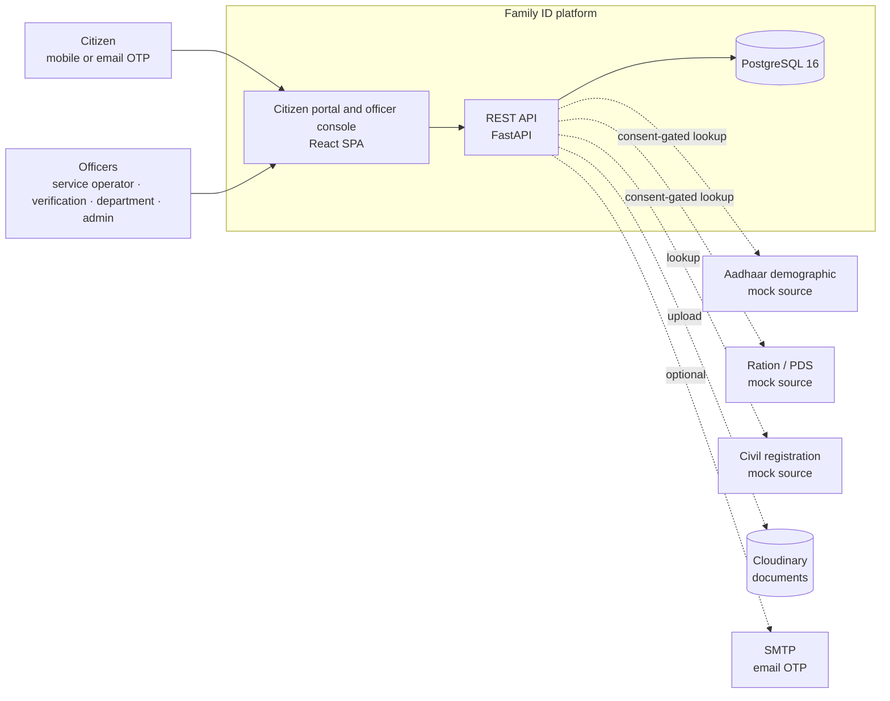
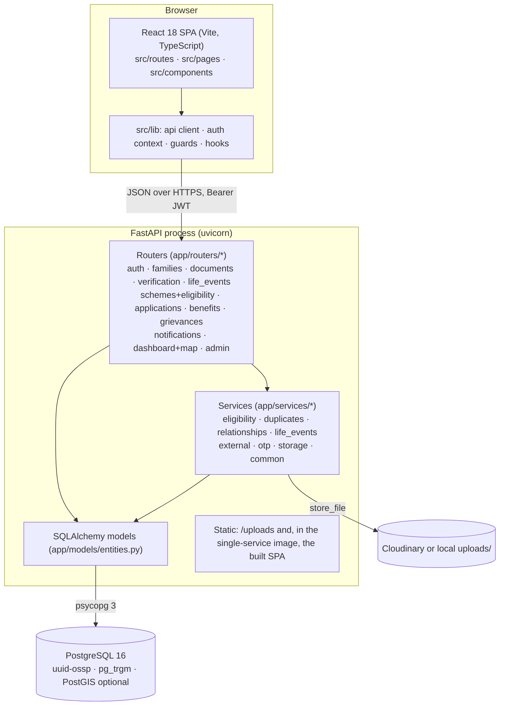
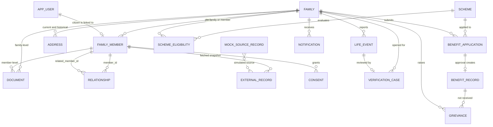
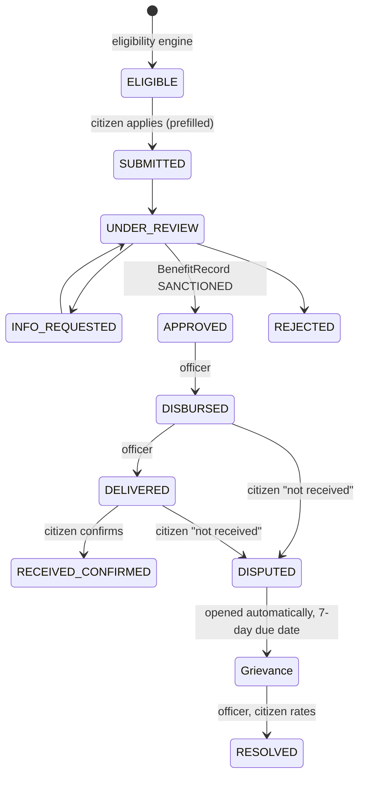
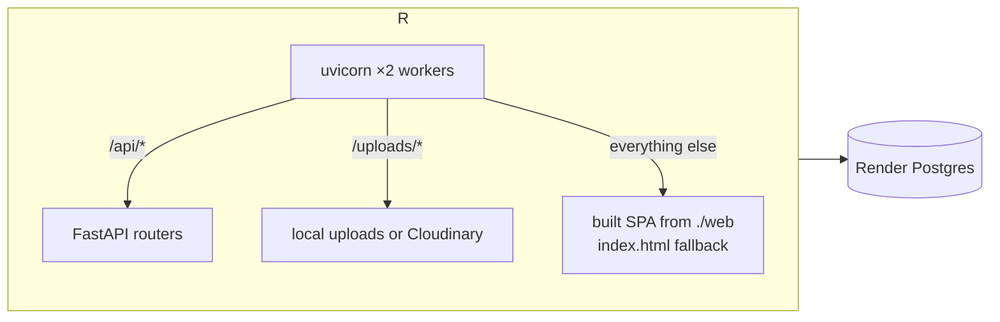

# Family ID — Architecture

This document describes how the platform is built: its components, the data model, the core engines,
the main request flows, security boundaries and the two deployment topologies. It is written against
the code as it exists in this repository; file paths are given so each section can be checked.

## Contents

1. [System context](#1-system-context)
2. [Component architecture](#2-component-architecture)
3. [Backend internals](#3-backend-internals)
4. [Data model](#4-data-model)
5. [Core engines](#5-core-engines)
6. [Key flows](#6-key-flows)
7. [Frontend architecture](#7-frontend-architecture)
8. [Security, privacy and audit](#8-security-privacy-and-audit)
9. [Deployment topologies](#9-deployment-topologies)
10. [Configuration](#10-configuration)
11. [Design decisions and trade-offs](#11-design-decisions-and-trade-offs)
12. [Extension points](#12-extension-points)

## 1. System context



The platform owns exactly one thing: the **unified family profile** and everything derived from it
(Family ID, eligibility, applications, benefits, grievances). It does **not** own government source
databases. External systems are represented by the `MockSourceRecord` table (`backend/app/models/
entities.py`) and reached only through `app/services/external.py`, which stores a *reference plus a
fetched snapshot* (`ExternalRecord`) rather than copying the source. Replacing a mock with a real
integration means changing that one service.

## 2. Component architecture



| Layer | Technology | Responsibility |
|---|---|---|
| Frontend | React 18, Vite 5, TypeScript, react-router v6, Leaflet | Two portals in one SPA, no UI library; design tokens in `src/styles/tokens.css` per `DESIGN.md` |
| API | FastAPI 0.115, Pydantic v2, uvicorn | Stateless REST, JWT bearer auth, OpenAPI at `/docs` |
| Domain logic | Plain Python services | Eligibility rules, duplicate scoring, life-event application, external matching |
| Persistence | SQLAlchemy 2.0 (sync), psycopg 3, PostgreSQL 16 | UUID keys, JSONB for rules/evidence/history, trigram index for name matching |
| Files | Cloudinary SDK with local fallback | Document binaries; metadata always in Postgres |
| Auth | OTP challenge table + HS256 JWT | Passwordless login by mobile or email |

## 3. Backend internals

### Request lifecycle

1. `app/main.py` creates the app, registers CORS, mounts `/uploads`, then includes every router under
   the `/api` prefix. Routers are discovered by module name; a module may also export `extra_routers`
   (used for `/eligibility` and `/map`).
2. `app/core/security.get_current_user` decodes the bearer token, loads the `User` and rejects
   inactive accounts. `require_roles(...)`, `require_officer` and `require_admin` wrap it for
   authorization.
3. Each request gets a session from `app/core/database.get_db`; handlers commit explicitly after
   mutations. Any uncommitted work is rolled back when the session closes, so validation errors raised
   mid-handler cannot leave partial rows behind.
4. `app/routers/deps.py` holds the two access-control helpers used everywhere: `my_family` (the
   citizen's own family via `User.member_id`) and `load_family`, which lets officers open any family
   but confines a citizen to their own.
5. A global `HTTPException` handler runs `jsonable_encoder` over error details so dates, UUIDs and
   Decimals from service code can never turn a 4xx into a 500.

### Startup

`run_startup_migrations()` in `app/core/database.py` runs inside the FastAPI lifespan: it takes a
Postgres advisory lock, creates the `uuid-ossp` and `pg_trgm` extensions, attempts PostGIS in a
**separate transaction** (so a missing PostGIS cannot roll back the required extensions), then runs
`Base.metadata.create_all`. The lock matters because the Docker image runs two uvicorn workers, each
of which executes the lifespan.

### Cross-cutting helpers (`app/services/common.py`)

- `audit(...)` writes an `AuditLog` row (actor, action, entity, old and new values) — called from
  every mutating handler.
- `notify(...)` writes a `Notification` for a family or user.
- `generate_family_code` produces the public Family ID `GJ-<district code>-<yy>-<6 digits>` from a
  per-key counter table (`id_sequence`); `generate_number` does the same for `VC-`, `APP-` and `GRV-`
  numbers.
- `normalize_name` folds case, honorifics and common transliteration variants so that "Rajesh" and
  "Rakesh" compare closely in trigram similarity.
- `jsonable` makes any ORM object or value safe for JSON and JSONB.

### Module map

| Path | Purpose |
|---|---|
| `app/core/config.py` | `Settings` from `.env`; normalises `postgres://` URLs to `postgresql+psycopg://` |
| `app/core/database.py` | Engine, session factory, startup migrations, PostGIS detection |
| `app/core/security.py` | JWT issue/verify, role dependencies |
| `app/routers/auth.py` | OTP request/verify, `/auth/me`; creates a `CITIZEN` user on first verified login |
| `app/routers/families.py` | Enrolment, members, relationships, consents, external fetch, checks, submit |
| `app/routers/documents.py` | Multipart upload to Cloudinary/local, officer verification |
| `app/routers/verification.py` | Officer case queue, side-by-side comparison, decisions incl. merge |
| `app/routers/life_events.py` | Birth (creates provisional newborn), marriage, death, divorce, address change, split |
| `app/routers/schemes.py` | Scheme CRUD with rule validation, `/eligibility/*`, previews |
| `app/routers/applications.py` | Application lifecycle; approval creates a `BenefitRecord` |
| `app/routers/benefits.py` | Delivery status chain; "not received" opens a grievance |
| `app/routers/grievances.py` | Grievance lifecycle with escalation, resolution, rating |
| `app/routers/dashboard.py` | Summary counts, district/scheme/application/benefit/case reports, map endpoints |
| `app/routers/admin.py` | Audit log query, user management, enum metadata |
| `app/routers/assistant.py` | AI assistant, **mock**: `/assistant/status` and `/assistant/chat` with fixed, role-aware sample answers and page links; the contract is final, the answer generator is the placeholder |
| `app/main.py` (`/api/ping`) | Unauthenticated, database-free keep-alive target for external monitors (GET and HEAD) |
| `app/services/eligibility.py` | Rule evaluation and family-wide recalculation |
| `app/services/duplicates.py` | Duplicate person/family scoring, case opening, automatic checks |
| `app/services/relationships.py` | Inverse relationship types and impossible-relationship detection |
| `app/services/life_events.py` | Applies verified events; family split and merge |
| `app/services/external.py` | Consent check, mock source lookup, match scoring, existing-record search |
| `app/services/otp.py` | OTP issue/verify (hashed), SMTP send |
| `app/services/storage.py` | `store_file`: Cloudinary when configured, else `uploads/` |
| `app/seed.py` | Deterministic demo dataset |

## 4. Data model



Conventions, all in `app/models/entities.py`:

- **UUID primary keys** everywhere; human-readable codes (`family_code`, `case_number`,
  `application_number`, `grievance_number`) are separate, unique, indexed columns.
- **Status columns are strings**, not Postgres enums, so new states need no migration. The valid
  values are listed in comments next to each column and mirrored in `API_CONTRACT.md`.
- **JSONB** holds anything shaped like a document: scheme `eligibility_rules`,
  `required_documents`, `exclusive_with`; case `evidence`; application `status_history` and
  `prefilled_data`; benefit `delivery_log`; grievance `history`; external `fetched_data`.
- **History is preserved, never overwritten.** Members that leave get `member_status = LEFT` and a
  `left_date`; relationships get an `end_date`; addresses are versioned by `valid_from`/`valid_to`
  with one `is_current`; a merged family keeps its row with `merged_into_family_id`; a split member
  keeps `previous_family_id`.
- **Aadhaar is never stored in clear.** `aadhaar_reference` is a salted SHA-256 prefix and
  `aadhaar_last4` is kept for display; the API masks it as `XXXX-XXXX-1234`.
- **Documents** are one table for both member and family documents (`owner_type`), holding metadata,
  verification status and either a `cloudinary_file_id` or a local `file_url`.
- **Geo**: `Address.latitude/longitude` are plain numerics so the map works without PostGIS; PostGIS
  is enabled opportunistically at startup.
- A GIN trigram index on `family_member.name_normalized` backs duplicate detection.

## 5. Core engines

### 5.1 Eligibility engine (`app/services/eligibility.py`)

A scheme's rules are data, not code:

```json
[{"field": "age", "op": ">=", "value": 60, "label": "Age 60 or above"},
 {"field": "annual_income", "op": "<=", "value": 300000, "label": "Family income up to 3 lakh"}]
```

- `build_context` derives every rule field from the family and (for member-targeted schemes) the
  member: age, gender, income and category, district/taluka/village, family size, child and senior
  counts, disability, student status, widowhood, verification flags, and so on. `FIELD_LABELS` is the
  authoritative list, also served to the rule builder UI via `/schemes/rule-fields`.
- `evaluate` walks the rules with operators `== != > >= < <= between in not_in contains exists
  is_true is_false`. A rule whose input is **unknown** (not recorded) does not fail the scheme; it
  puts it **under review**, so missing data is surfaced rather than silently disqualifying.
- It then checks `required_documents` against the family's and member's uploaded documents
  (missing → `NEEDS_DOCUMENT`; uploaded but unverified → `UNDER_REVIEW`), active benefits for the
  same scheme, and `exclusive_with` schemes already held. An unverified family is never `ELIGIBLE`.
- The result is one of `ELIGIBLE`, `NOT_ELIGIBLE`, `NEEDS_DOCUMENT`, `UNDER_REVIEW` with a
  plain-English summary ("Eligible because …", "Not eligible because …", "Missing document: …")
  and a per-rule breakdown, stored in `scheme_eligibility`.
- `recalculate_family` re-evaluates every active scheme for a family and emits a
  `NEW_SCHEME_AVAILABLE` notification when a scheme flips to eligible. It is called after any
  change that could affect eligibility: document upload or verification, member edits, family
  verification, life events, application approval.

### 5.2 Duplicate detection (`app/services/duplicates.py`)

Built for the panel's concern that one person enrols twice under a spelling variant or a second
Aadhaar. No single key is trusted; each candidate is **scored**:

| Signal | Weight |
|---|---|
| Name trigram similarity ≥ 0.85 / ≥ 0.6 (after `normalize_name`) | 0.35 / 0.22 |
| Identical date of birth / within one year | 0.25 / 0.08 |
| Same father or husband name | 0.15 |
| Same mobile number | 0.20 |
| Same Aadhaar reference | 0.50 |
| Same gender, same village | 0.05, 0.08 |

Scores ≥ 0.62 are **REVIEW** and ≥ 0.90 are **BLOCK**. Adding a member that scores BLOCK returns
HTTP 409 with the candidates unless the caller sets `force`; anything at REVIEW or above is accepted
but flagged (`verification_status = FLAGGED`) and a `DUPLICATE_PERSON` case is opened with the
evidence. A different Aadhaar on an otherwise identical identity is called out explicitly in the
reasons. `find_duplicate_families` aggregates member matches across households; `run_family_checks`
runs all automatic checks (duplicate family, duplicate person, Aadhaar mismatch against external
records, relationship sanity, declared-versus-added member count) and is invoked on submit.

`open_case` is idempotent per (type, family, member) while a case is still open, and passes evidence
through `jsonable` so JSONB inserts cannot fail on raw types.

### 5.3 Relationship rules (`app/services/relationships.py`)

Relationships are stored **in both directions**. `inverse_type` derives the inverse from the related
person's gender (FATHER of X ⇒ X is SON/DAUGHTER). `relationship_conflicts` catches impossible
data: a parent fewer than 12 years older than a child, a spouse under 18, more than one active
spouse, or a self-relationship.

### 5.4 Life events (`app/services/life_events.py`)

Every event is reported by the citizen, opens a `LIFE_EVENT` verification case, and is applied only
when an officer approves it. `apply_life_event` then mutates the profile while keeping history:

- **Death** — member `DECEASED`, relationships and benefits closed, head transferred, spouse marked
  widowed.
- **Divorce / separation** — spouse link ended; optionally moves the member to a new family
  (`_split_member`, which issues a new Family ID).
- **Marriage** — spouse relationship verified; a spouse from another family joins the household.
- **Adoption / guardianship** — parent or guardian link recorded, member moved if needed.
- **Address change / migration** — previous address closed, new one current; permanent moves update
  the family's district for location-based eligibility.
- **Birth** — the newborn was already created as a `PROVISIONAL` member without Aadhaar at report
  time (`routers/life_events.py`); approval verifies it.

Every branch ends with `recalculate_family`. `merge_families` moves members from a duplicate family
into the surviving one and marks the source `MERGED`.

### 5.5 External records (`app/services/external.py`)

Lookups are **consent-gated** per member and data source (`Consent` table); officers may bypass the
gate. A hit stores an `ExternalRecord` with the snapshot and a match status computed from name, date
of birth and gender (`MATCHED ≥ 90 %`, `PARTIAL ≥ 60 %`, else `MISMATCH`). Mismatches feed the
`AADHAAR_MISMATCH` case and the side-by-side comparison in the officer console. `search_existing`
powers the first enrolment step: is this person already in a family, and is there a Ration/PDS
household to seed members from?

## 6. Key flows

### 6.1 Login

```mermaid
sequenceDiagram
    participant B as Browser
    participant A as /api/auth
    participant D as Postgres
    B->>A: POST request-otp {channel, identifier}
    A->>D: insert OtpChallenge (hashed code, 10 min)
    A-->>B: challenge_id (+ dev_otp when DEV_MODE)
    B->>A: POST verify-otp {challenge_id, code, name?}
    A->>D: check hash, attempts ≤ 5, not expired; create CITIZEN user on first login
    A-->>B: JWT (HS256, 12 h) + user + family_id
    B->>B: persist token synchronously, route by role
```

The frontend writes the token to `localStorage` **before** updating React state
(`src/lib/auth.tsx`) so that components mounting immediately after login always send it; the API
client only force-logs-out on a 401 when a token was actually sent.

### 6.2 Enrolment to Family ID

```mermaid
sequenceDiagram
    participant C as Citizen
    participant API as API
    participant O as Officer
    C->>API: GET families/search-existing (mobile, Aadhaar, ration card)
    C->>API: POST families {declared_member_count, address, head}
    Note over API: duplicate scoring on head → 409 or flag
    C->>API: POST members (each with relationship) · POST documents
    Note over API: newborn under 1 year: no Aadhaar, PROVISIONAL
    C->>API: POST families/{id}/submit
    Note over API: run_family_checks → cases; status PENDING_VERIFICATION
    O->>API: GET verification/cases · GET case detail (comparison)
    O->>API: POST action APPROVE
    Note over API: family VERIFIED, family_code issued, members VERIFIED,<br/>recalculate_family, FAMILY_ID_CREATED notification
```

Aadhaar is required for every member except a declared newborn, enforced in
`routers/families._new_member` and mirrored in the wizard.

### 6.3 Benefit lifecycle and grievance



Application status lives on `benefit_application`; delivery status on `benefit_record`; both keep
append-only JSONB histories. Approval re-runs eligibility, which then reports the scheme as already
held.

## 7. Frontend architecture

- **Routing.** `src/App.tsx` composes `/login`, a citizen tree under `/` (`src/routes/citizen.tsx`)
  and an officer tree under `/officer` (`src/routes/officer.tsx`), each inside its layout. Guards in
  `src/lib/guards.tsx` redirect by role.
- **State.** No global store. `AuthProvider` holds the session; pages fetch with `useApi` and
  refetch after mutations. Toasts come from `ToastProvider`.
- **API client.** `src/lib/api.ts` prefixes `/api`, attaches the bearer token, JSON-encodes bodies,
  sends multipart for uploads, and resolves the API origin in this order: runtime `window.__ENV__`
  (two-service Docker image), build-time `VITE_API_URL`, then `http://localhost:8000`. An empty value
  means same origin (single-service image).
- **Components.** `src/components/` implements the design system in `DESIGN.md` (eyebrows, cards,
  stat tiles, tags, stepper, timeline, drawer, modal, table, notices) with tokens in
  `src/styles/tokens.css`. Charts are inline SVG; the map uses Leaflet with circle markers only.
- **Pages.** Citizen: Home, six-step Enrol wizard, Family profile, Schemes, Scheme apply,
  Applications, Benefits, Support, Notifications. Officer: Dashboard, Families, Cases, Schemes (rule
  builder), Applications, Benefits, Grievances, Reports, Map, Audit, Users.
- **Assistant (preview).** `src/components/Assistant.tsx` is mounted in both layouts: a floating
  launcher (bottom-right, labelled "Soon") opens a panel that shows the "coming soon" notice, role
  specific suggested questions from `/assistant/status`, and a conversation backed by
  `/assistant/chat`. Replies may carry page links rendered as pills. Swapping the backend's mock
  generator for a model changes nothing in this component.

## 8. Security, privacy and audit

- **Authentication**: passwordless OTP; codes are stored hashed with the JWT secret as salt, expire
  in 10 minutes and allow five attempts. In `DEV_MODE` the code is fixed and echoed for demos; in
  production it is sent by SMTP (email) — SMS delivery is a pluggable gap.
- **Authorization**: five roles. Citizens are confined to their own family by `load_family`; officer
  endpoints use `require_officer`; user and scheme administration require admin or department roles.
- **Data minimisation**: Aadhaar hashed with only the last four digits kept; the map returns Family
  ID, status and member count with coordinates offset by a deterministic jitter, never names.
- **Consent**: external lookups require a recorded consent per member and source.
- **Audit**: every create, update, decision, upload, login and officer view writes `audit_log` with
  before/after values; the officer console exposes it filtered by family, action, entity or actor.
- **Transport and secrets**: HTTPS is terminated by the platform (Render); uvicorn runs with
  `--proxy-headers`. Secrets come only from environment variables; the container runs as a non-root
  user.
- **Input safety**: Pydantic models validate all bodies; path-traversal is guarded in the static
  handler; JSONB and error payloads pass through `jsonable`/`jsonable_encoder`.

## 9. Deployment topologies

### Single service (default)



- Stage 1 of the root `Dockerfile` builds the frontend with `VITE_API_URL=""`; stage 2 installs the
  backend, PostgreSQL 17 and copies the build to `/app/web`. `app/main.py` serves it only when that
  directory exists.
- One origin ⇒ no CORS, no service URL to configure.
- **Zero-configuration mode.** `docker-entrypoint.sh` starts as root only to take ownership of
  `/app/data`, drops to `appuser`, and then: if `DATABASE_URL` is empty it initialises and starts an
  embedded PostgreSQL on loopback (`/app/data/pgdata`) and points the app at it; if `JWT_SECRET` is
  empty it generates one and keeps it in `/app/data/jwt_secret`; with `SEED_ON_BOOT=true` (default)
  it loads the demo data when the database has no users; finally it runs uvicorn and stops both
  processes cleanly on `SIGTERM`. Uploads are symlinked into `/app/data/uploads`, so one mounted
  disk at `/app/data` persists database, documents and secret together.
- `render.yaml` (Blueprint) provisions managed Postgres and injects `DATABASE_URL`, in which case
  the embedded server is never started; `render.env` lists optional overrides for a manual setup.
- On Render's ephemeral disk without a mounted Disk, embedded data and local uploads are lost on
  every deploy or restart; managed Postgres and Cloudinary are the durable options.

### Two services (alternative)

`backend/Dockerfile` (API) and `frontend/Dockerfile` (nginx serving the build; `docker-entrypoint.sh`
writes `env-config.js` from `API_URL` at container start so one image can target any backend).
Requires `CORS_ORIGINS` on the backend and `API_URL` on the frontend, both known only after first
deploy. `docker-compose.two-services.yml` reproduces it locally.

### Local development

Native: PostgreSQL 16 via Homebrew, `backend/run.sh` (uvicorn with reload on 8000), `npm run dev`
(Vite on 5173, `VITE_API_URL=http://localhost:8000`). `backend/scripts/demo_flow.py` runs a 30-step
end-to-end check against a seeded API.

## 10. Configuration

All settings are read by `app/core/config.py` from environment variables or `backend/.env`:

| Variable | Role |
|---|---|
| `DATABASE_URL` | Postgres URL; `postgres://` is rewritten to `postgresql+psycopg://`. Required outside the single-service image; there, empty means "start the embedded PostgreSQL" |
| `JWT_SECRET`, `JWT_EXPIRE_MINUTES` | Token signing and lifetime |
| `DEV_MODE`, `DEMO_OTP` | Fixed, echoed OTP for demos |
| `CORS_ORIGINS` | Comma-separated origins; unnecessary in the single-service deploy |
| `CLOUDINARY_*` | Enables Cloudinary storage when all three are set |
| `SMTP_*` | Enables email OTP when host, user and password are set |
| `PORT`, `WEB_CONCURRENCY` | Listen port and uvicorn workers (container entrypoint) |
| `SEED_ON_BOOT`, `SEED_RESET` | Load demo data on boot; `SEED_RESET` drops all tables first |

Frontend: `VITE_API_URL` at build time, or `API_URL` at runtime for the two-service image.

## 11. Design decisions and trade-offs

- **Rules as data, not code.** New schemes are configured by department officers in the UI; the
  engine, not the scheme, decides what "unknown" means. Cost: complex cross-member rules (for
  example "at least one disabled member") need a derived context field rather than a rule.
- **Scored duplicate detection over exact keys.** Catches spelling variants and multiple-Aadhaar
  cases; produces false positives that an officer must clear. Thresholds are constants in
  `duplicates.py`.
- **`create_all` instead of migrations.** Appropriate for a demonstration; a production rollout
  should adopt Alembic before the first schema change.
- **Synchronous SQLAlchemy.** Simpler code and debugging; throughput scales with uvicorn workers,
  which the advisory lock makes safe.
- **String statuses and JSONB histories.** Flexible and auditable; validated in code and documented
  in `API_CONTRACT.md` rather than enforced by the database.
- **Mocked government sources.** Keeps the demo self-contained; the `ExternalRecord` snapshot model
  is what a real integration would populate.
- **One SPA for both portals.** Shared design system and auth; route trees and layouts are separate,
  so they could be split into two builds later.

## 12. Extension points

- **AI assistant**: replace `_mock_reply` in `app/routers/assistant.py` with a language-model call.
  The natural context is the caller's family profile (`family_detail`), their `scheme_eligibility`
  rows with reasons, and the scheme rules; keep answers grounded in those records and return page
  links in the existing `links` shape. Flip `available` to `true` in `/assistant/status` when live.
- **Real source integrations**: implement a client in `app/services/external.py` returning the
  same payload keys (`name`, `date_of_birth`, `gender`, `father_name`, …); nothing downstream changes.
- **SMS OTP**: add a sender in `app/services/otp.py` next to `send_email`.
- **New eligibility inputs**: add a key to `build_context` and `FIELD_LABELS`; the rule builder
  picks it up automatically.
- **New life event types**: add a branch in `apply_life_event` and the event to the frontend modal.
- **Persistent uploads without Cloudinary**: mount a disk at `/app/uploads` or add another
  provider in `app/services/storage.store_file`.
- **Migrations**: introduce Alembic and call `upgrade head` from `run_startup_migrations` in place
  of `create_all`.
