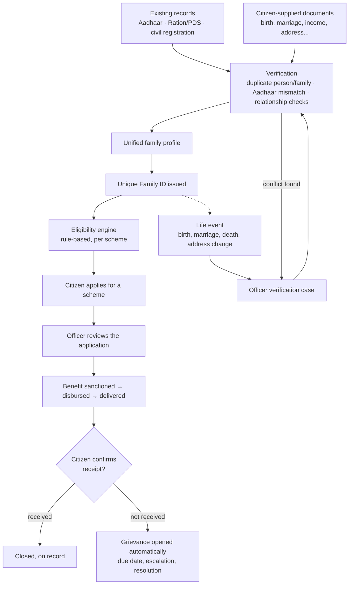

# Family ID — Unified Family Identity and Benefits Platform

A Gujarat government demonstration build. One verified family profile, built from existing government
records plus citizen documents, drives a unique Family ID, a rule-based eligibility engine, benefit
applications with end-to-end delivery tracking, and grievance redressal.

**Stack:** FastAPI + SQLAlchemy 2 + PostgreSQL 16 (PostGIS optional) · React 18 + Vite + TypeScript ·
Cloudinary for documents (falls back to local storage) · mobile or email OTP login.

## Contents

1. [Problem statement](#1-problem-statement)
2. [Our solution](#2-our-solution)
3. [Impact](#3-impact)
4. [Use cases](#4-use-cases)
5. [How it works](#5-how-it-works)
6. [Architecture](#6-architecture)
7. [Quick start](#7-quick-start)
8. [Two portals](#8-two-portals)
9. [Demo logins (OTP is `123456` in DEV_MODE)](#9-demo-logins-otp-is-123456-in-dev_mode)
10. [Resetting demo data](#10-resetting-demo-data)
11. [Project layout](#11-project-layout)
12. [Documents](#12-documents)
13. [Panel feedback addressed](#13-panel-feedback-addressed)
14. [Troubleshooting](#14-troubleshooting)
15. [Deployment](#15-deployment)

## 1. Problem statement

A family in Gujarat today proves who it is separately to every department it deals with. Ration
records, Aadhaar, birth and marriage certificates, income certificates and disability certificates all
exist, but nowhere are they combined into one record that a scheme's eligibility can be checked against.
This causes four concrete problems:

- **The same paperwork, filed again for every scheme.** A family eligible for five schemes submits its
  identity and income proof five separate times, to five separate offices.
- **No single source of truth for eligibility.** A department cannot see, at a glance, which of its
  schemes a household already qualifies for — eligibility is worked out by hand, per application, every
  time.
- **Identity fraud is hard to catch.** Nothing stops the same person enrolling twice under a spelling
  variant of their name, or holding more than one Aadhaar-linked identity, to draw a benefit more than
  once — a concern raised directly by the review panel (the "Rajesh Kumar / Rakesh Kumar" scenario).
- **No visibility after a benefit is approved.** A ration or cash benefit can be sanctioned and then
  simply never reach the family, with no system tracking whether it was actually delivered, and no
  structured way for the citizen to report it and have the report followed up.

## 2. Our solution

```
existing records + citizen documents → verification → unified family profile
    → unique Family ID → eligibility engine → schemes and benefits → continuous updates
```

The Family ID platform builds one verified family profile per household by combining existing
government records (Aadhaar, Ration/PDS, civil registration) with documents the citizen uploads,
resolves any conflicts through an officer verification workflow, and issues a single Family ID once the
household is confirmed. Every scheme's eligibility rules then run automatically against that one
profile, so a family sees what it qualifies for without filing anything twice, and a benefit is tracked
from application through to the citizen confirming they actually received it — with a grievance opened
automatically if they did not.

## 3. Impact

Gujarat's food security scheme alone covers 75 lakh families, 3.25 crore people, each of whom
re-proves identity to every department separately today. Nationally, 5.2 crore fake or duplicate
ration cards existed before biometric de-duplication caught them, and Direct Benefit Transfer's leak
plugging has saved ₹3.48 lakh crore. Haryana's Family ID model already runs at 70 lakh families and
2.6 crore residents. Ours adds what that model still lacks: benefits tracked all the way to citizen
confirmed delivery, and duplicate identities caught at enrolment instead of years later in an audit.

Sources: [Gujarat NFSA coverage](https://thefederal.com/states/west/gujarat/over-68-lakh-families-to-get-free-foodgrains-under-nfsa-again) ·
[DBT savings, ₹3.48 lakh crore](https://www.business-standard.com/economy/news/dbt-saves-3-48-trillion-reshapes-india-s-welfare-delivery-system-125041701278_1.html) ·
[Haryana Parivar Pehchan Patra](https://meraparivar.haryana.gov.in/)

### Real problems it solves

| Real-life problem | How Family ID solves it |
|---|---|
| A family proves its identity separately to every department, filing the same documents again for each scheme | One verified profile per household, reused automatically across every scheme |
| No one can tell a family what it actually qualifies for; eligibility is worked out by hand, per application | An eligibility engine checks every scheme automatically and gives a plain reason for each result |
| A ration or cash benefit is sanctioned but never confirmed as delivered, and there is no way to report it | Delivery is tracked through to the citizen confirming receipt, and a grievance opens automatically if it is reported missing |
| The same person enrols twice under a spelling variant of their name or a second Aadhaar to draw a benefit twice | Enrolment is scored against name, date of birth, parent's name, mobile and Aadhaar, and a close match is held for an officer to decide |
| A newborn or a person without Aadhaar cannot be added to a household record at all | A newborn can be added with just a birth certificate, and identity can be verified through other documents when Aadhaar is unavailable |
| A birth, death, marriage or house move means updating records at multiple offices separately | Life events are reported once, verified by an officer, and every dependent record updates automatically |
| Citizens without a smartphone or literacy struggle to self-enrol online | A service operator role completes the same enrolment on a citizen's behalf at a service centre |

## 4. Use cases

- **A new household enrols.** A citizen checks whether a record already exists for them, declares their
  household size up front, adds each member with a required Aadhaar number (a newborn is the one
  exception — added with just a birth certificate), uploads supporting documents, and submits for an
  officer to verify. A unique Family ID is issued once approved.
- **Automatic scheme matching.** Once verified, the family's profile is checked against every active
  scheme's rules (age, income, disability, family size, district, and so on), and each member sees a
  plain-English reason for why they are or are not eligible, and what document is still missing.
- **Stopping duplicate-identity fraud.** When a new member's name, date of birth, parent's name or
  Aadhaar closely matches someone already enrolled elsewhere, the system holds it for officer review
  with a similarity score and the matching evidence, instead of silently allowing a second enrolment.
- **A life event updates the family automatically.** A birth, marriage, death, divorce or address change
  is reported once, verified by an officer, and the family's relationships, eligibility and benefits
  recalculate from it — with the previous state kept as history.
- **Tracking a benefit to actual delivery.** After approval, a benefit moves through sanctioned →
  disbursed → delivered, and the citizen confirms receipt. If they say they did not receive it, a
  grievance is opened automatically with a due date and an escalation path.
- **Officer oversight across districts.** An officer's console shows pending verification, open
  duplicate cases, scheme-wise and district-wise eligibility, and a map view — without exposing personal
  details on the map.
- **AI assistant (coming soon).** A floating assistant in both portals answers questions about
  eligibility, documents, life events, benefits and grievances and links to the right page. The API
  and the panel are in place and answers currently come from fixed samples. The planned model
  provider is **OpenRouter**: the assistant will send the citizen's own eligibility results and scheme
  rules as context to a configurable model through OpenRouter's OpenAI-compatible API, and stay in
  preview mode whenever no `OPENROUTER_API_KEY` is configured. See
  [ARCHITECTURE.md](docs/ARCHITECTURE.md#56-ai-assistant-openrouter).

## 5. How it works



## 6. Architecture

```mermaid
flowchart LR
    subgraph Browser
        U[Citizen / Officer]
    end

    subgraph "Frontend — React 18 + Vite + TypeScript"
        FE[Static build<br/>served by the backend (single service)]
    end

    subgraph "Backend — FastAPI + SQLAlchemy 2"
        BE[REST API<br/>uvicorn]
        ENG[Eligibility engine<br/>duplicate detection<br/>life events]
    end

    DB[(PostgreSQL 16<br/>+ optional PostGIS)]
    CLOUD[(Cloudinary<br/>document storage)]
    SMTP[SMTP<br/>email OTP, optional]
    LLM[OpenRouter<br/>AI assistant model, planned]

    U -->|HTTPS| FE
    FE -->|REST + JWT, direct browser calls| BE
    BE --> ENG
    BE -->|SQLAlchemy| DB
    BE -->|document upload| CLOUD
    BE -->|OTP delivery| SMTP
    BE -.->|grounded prompts, no Aadhaar| LLM
```

Backend and frontend are two independent services with no server-side coupling: the browser calls the
backend directly, and either side can be redeployed, rebuilt or moved without touching the other. See
[Deployment](#15-deployment) for how this ships as one container, optionally with a managed Postgres
instance.

## 7. Quick start

Requires PostgreSQL 16 running locally, Python 3.12, Node 18+, and [uv](https://docs.astral.sh/uv/).

```bash
# 1. database
createdb familyid

# 2. backend — http://localhost:8000 (API docs at /docs)
cd backend
cp .env.example .env
uv venv --python 3.12 .venv && uv pip install -r requirements.txt --python .venv/bin/python
.venv/bin/python -m app.seed --reset
./run.sh

# 3. frontend — http://localhost:5173
cd frontend
npm install
npm run dev
```

Open [http://localhost:5173](http://localhost:5173) and sign in with any demo login below (OTP `123456`).

## 8. Two portals

- **Citizen portal** (`/`) — enrol a household, manage members and documents, check scheme eligibility,
  apply for benefits, track delivery status, and raise grievances.
- **Officer console** (`/officer`) — verify families and resolve duplicate-identity cases, manage
  schemes and eligibility rules, review applications and benefit delivery, handle grievances, and view
  district reports and the family map. Roles: service operator, verification officer, department
  officer, admin.

Which portal you land on after login is decided by your account's role — a citizen always lands on `/`,
every other role lands on `/officer`.

## 9. Demo logins (OTP is `123456` in DEV_MODE)

| # | Role | Identifier | Notes |
|---|---|---|---|
| 1 | Citizen | mobile `9876500001` | Ramesh Patel — verified family in Ahmedabad, has active applications and benefits |
| 2 | Citizen | mobile `9876500002` | Suresh Chauhan — no family yet; a Ration/PDS household is available to claim during enrolment |
| 3 | Service operator | mobile `9000000001` | Kiran Desai |
| 4 | Verification officer | mobile `9000000002` | Bhavna Trivedi |
| 5 | Department officer | mobile `9000000003` | Nilesh Joshi |
| 6 | Admin | mobile `9000000004` or email `admin@familyid.gov.in` | Anita Sharma |

The login page also has a **Create new citizen** option for a fresh, non-demo account: enter any new
mobile number or email and a name, and it creates a citizen account on the spot.

## 10. Resetting demo data

`backend/app/seed.py --reset` drops and rebuilds every table, then reloads the standard demo dataset.
Run it whenever you want a clean state for a walkthrough:

```bash
cd backend && .venv/bin/python -m app.seed --reset
```

**This permanently deletes everything in the database** — every account, family, application and
grievance, including ones created through the app itself (such as a new citizen account made from the
login page). Anything you want to keep should be noted down first; there is no undo. Without `--reset`,
the script only seeds an empty database and otherwise does nothing, so it is safe to run at any time.

## 11. Project layout

```
docs/API_CONTRACT.md          every backend endpoint and payload shape
docs/FRONTEND_CONTRACT.md      component and page inventory for the frontend
docs/DESIGN.md                 design system brief (tokens, type, layout rules)
docs/DEMO_SCRIPT.md             a ten-minute walkthrough of the full story
docs/DEPLOY.md                   Render deployment guide
docs/ARCHITECTURE.md              detailed architecture: components, data model, engines, flows, deployment
Dockerfile                   single-service image: backend + built frontend (+ embedded Postgres), one port
docker-entrypoint.sh          entrypoint for that image (embedded database, secret, seeding, $PORT)
docker-compose.yml            runs the single-service image + Postgres locally
docker-compose.two-services.yml  alternative: separate backend and frontend containers
render.yaml                   Render Blueprint: one web service + managed Postgres
render.env                    its environment variables, importable via Render's "Add from .env"
deploy/two-services/render-backend.env            two-service alternative: backend variables
deploy/two-services/render-frontend.env           two-service alternative: frontend variable

backend/
  app/main.py              FastAPI app, router registration, static /uploads mount
  app/core/                settings (.env), database engine/session, security (JWT, OTP)
  app/models/entities.py   every SQLAlchemy model — single source of truth for response shapes
  app/routers/             one module per API area (auth, families, documents, verification, ...)
  app/services/            eligibility engine, duplicate detection, external source mocks, life events
  app/seed.py               deterministic demo data
  scripts/demo_flow.py      end-to-end smoke test against a running, seeded API
  Dockerfile                 production image (uvicorn)
  README.md                 backend setup, environment variables, seed details

frontend/
  src/main.tsx, src/App.tsx  entry point and route tree
  src/lib/                    api client, auth context, route guards, formatting, hooks
  src/components/             shared design-system components
  src/layouts/                CitizenLayout, OfficerLayout, navbar/footer shell
  src/pages/auth/              OTP login and account creation
  src/pages/citizen/           citizen portal pages
  src/pages/officer/           officer console pages
  Dockerfile                    production image (Vite build served by nginx)
  README.md                    frontend setup and structure
```

## 12. Documents

| Document | Covers |
|---|---|
| [API_CONTRACT.md](docs/API_CONTRACT.md) | every endpoint and payload |
| [FRONTEND_CONTRACT.md](docs/FRONTEND_CONTRACT.md) | component and page inventory |
| [DESIGN.md](docs/DESIGN.md) | design system brief |
| [DEMO_SCRIPT.md](docs/DEMO_SCRIPT.md) | a ten-minute walkthrough of the full story |
| [ARCHITECTURE.md](docs/ARCHITECTURE.md) | detailed architecture: components, data model, engines, flows, deployment |
| [DEPLOY.md](docs/DEPLOY.md) | Render deployment guide |
| [backend/README.md](backend/README.md) | backend setup, environment variables, seed details |
| [frontend/README.md](frontend/README.md) | frontend setup and structure |

## 13. Panel feedback addressed

1. **Full benefit status chain:** Eligible → Applied → Under review → Approved → Sanctioned →
   Disbursed → Delivered → Received, with citizen confirmation of receipt.
2. **Grievance and redressal module** with due dates, escalation and ratings; "not received"
   automatically opens a grievance.
3. **Multiple-identity fraud** (the "Rajesh / Rakesh Kumar" scenario): scored duplicate detection over
   name variants, date of birth, parent name, mobile, Aadhaar and locality; anything above the review
   threshold is held for officer decision rather than silently accepted. Aadhaar is required for every
   member above one year old, with only a newborn exempted (identified by birth certificate).
4. **Household size is asked up front**, during enrolment, and reconciled against the members actually
   added.
5. **Login by mobile or email OTP**, with SMTP credentials pluggable for real email delivery, plus an
   explicit "create a new citizen account" path from the login screen.

## 14. Troubleshooting

1. **`createdb: database creation failed`** — PostgreSQL is not running, or a database named `familyid`
   already exists. Check with `pg_isready` and `psql -l`.
2. **Port already in use** — another instance of the backend (`8000`) or frontend (`5173`) is already
   running; stop it or pass a different port (`--port` for uvicorn, `--port` for `npm run dev`).
3. **CORS errors in the browser console** — the frontend's `VITE_API_URL` (in `frontend/.env`) does not
   match where the backend is actually running, or the backend's `CORS_ORIGINS` (in `backend/.env`) does
   not include the frontend's origin.
4. **PostGIS-related warnings at startup** — PostGIS is optional; the app falls back to plain latitude
   and longitude columns and works without it.
5. **A page looks empty after signing in** — the demo data may have been reset since you last used it
   (see [Resetting demo data](#10-resetting-demo-data)); sign in again with a current demo login, or
   re-create what you need.

## 15. Deployment

**Zero configuration:** push the repository, add it on Render as a Docker **Web Service**, set no
environment variables. The root [`Dockerfile`](Dockerfile) produces one container that serves the
API and the built frontend on one port and, when no `DATABASE_URL` is given, runs an embedded
PostgreSQL and seeds the demo data itself. For data that must survive redeploys, apply the
[`render.yaml`](render.yaml) blueprint instead: it adds a managed Postgres and wires it in, still
with no prompts. Both paths, persistence trade-offs and every optional setting are in
**[DEPLOY.md](docs/DEPLOY.md)**.

Try the exact image locally, either self-contained or with a separate Postgres:

```bash
docker build -t familyid . && docker run --rm -p 8000:8000 familyid   # embedded database
docker compose up --build                                               # separate Postgres
```

**Keeping a free instance awake.** Render's free web services spin down after 15 minutes without
traffic, and the next visitor waits for a cold start. Point an external monitor such as UptimeRobot at
`https://<your-service>.onrender.com/api/ping` every 5 to 10 minutes; the endpoint needs no login,
touches no database, answers `GET` and `HEAD`, and returns `{"ok": true, "at": "..."}`.

Then open [http://localhost:8000](http://localhost:8000) (API docs at `/docs`). A two-service layout
([`backend/Dockerfile`](backend/Dockerfile) + [`frontend/Dockerfile`](frontend/Dockerfile)) remains
available for when the API and the frontend must scale independently.
