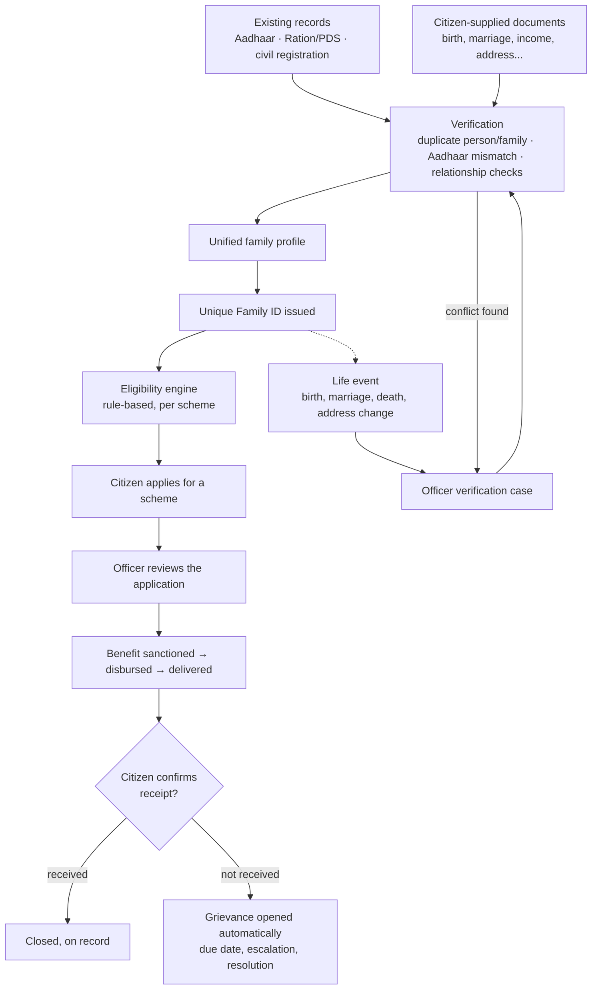
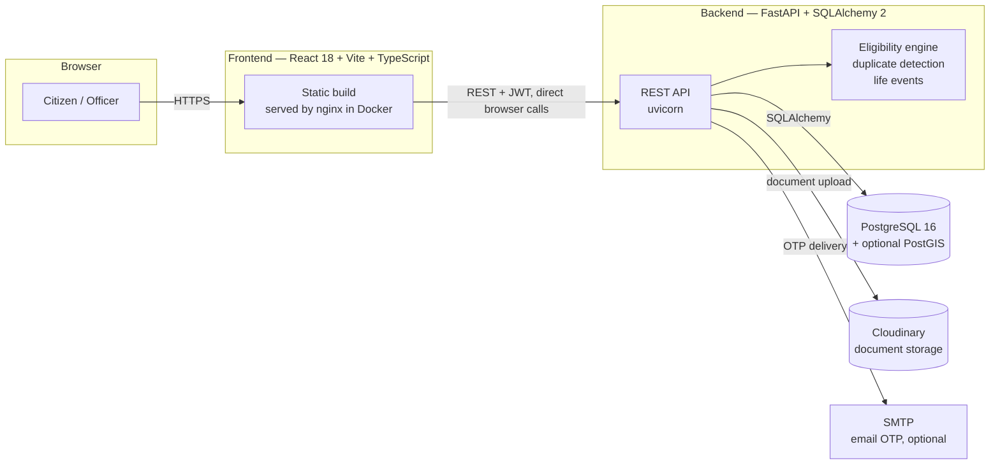

# Family ID — Unified Family Identity and Benefits Platform

A Gujarat government demonstration build. One verified family profile, built from existing government
records plus citizen documents, drives a unique Family ID, a rule-based eligibility engine, benefit
applications with end-to-end delivery tracking, and grievance redressal.

**Stack:** FastAPI + SQLAlchemy 2 + PostgreSQL 16 (PostGIS optional) · React 18 + Vite + TypeScript ·
Cloudinary for documents (falls back to local storage) · mobile or email OTP login.

## Contents

- [How it works](#how-it-works)
- [Architecture](#architecture)
- [Quick start](#quick-start)
- [Two portals](#two-portals)
- [Demo logins](#demo-logins-otp-is-123456-in-dev_mode)
- [Resetting demo data](#resetting-demo-data)
- [Project layout](#project-layout)
- [Documents](#documents)
- [Panel feedback addressed](#panel-feedback-addressed)
- [Troubleshooting](#troubleshooting)
- [Deployment](#deployment)

## How it works



## Architecture



Backend and frontend are two independent services with no server-side coupling: the browser calls the
backend directly, and either side can be redeployed, rebuilt or moved without touching the other. See
[Deployment](#deployment) for how this maps onto two Docker containers plus a managed Postgres instance.

## Quick start

Requires PostgreSQL 16 running locally, Python 3.12, Node 18+, and [uv](https://docs.astral.sh/uv/).

```bash
# database
createdb familyid

# backend — http://localhost:8000 (API docs at /docs)
cd backend
cp .env.example .env
uv venv --python 3.12 .venv && uv pip install -r requirements.txt --python .venv/bin/python
.venv/bin/python -m app.seed --reset
./run.sh

# frontend — http://localhost:5173
cd frontend
npm install
npm run dev
```

Open [http://localhost:5173](http://localhost:5173) and sign in with any demo login below (OTP `123456`).

## Two portals

- **Citizen portal** (`/`) — enrol a household, manage members and documents, check scheme eligibility,
  apply for benefits, track delivery status, and raise grievances.
- **Officer console** (`/officer`) — verify families and resolve duplicate-identity cases, manage
  schemes and eligibility rules, review applications and benefit delivery, handle grievances, and view
  district reports and the family map. Roles: service operator, verification officer, department
  officer, admin.

Which portal you land on after login is decided by your account's role — a citizen always lands on `/`,
every other role lands on `/officer`.

## Demo logins (OTP is `123456` in DEV_MODE)

| Role | Identifier | Notes |
|---|---|---|
| Citizen | mobile `9876500001` | Ramesh Patel — verified family in Ahmedabad, has active applications and benefits |
| Citizen | mobile `9876500002` | Suresh Chauhan — no family yet; a Ration/PDS household is available to claim during enrolment |
| Service operator | mobile `9000000001` | Kiran Desai |
| Verification officer | mobile `9000000002` | Bhavna Trivedi |
| Department officer | mobile `9000000003` | Nilesh Joshi |
| Admin | mobile `9000000004` or email `admin@familyid.gov.in` | Anita Sharma |

The login page also has a **Create new citizen** option for a fresh, non-demo account: enter any new
mobile number or email and a name, and it creates a citizen account on the spot.

## Resetting demo data

`backend/app/seed.py --reset` drops and rebuilds every table, then reloads the standard demo dataset.
Run it whenever you want a clean state for a walkthrough:

```bash
cd backend && .venv/bin/python -m app.seed --reset
```

**This permanently deletes everything in the database** — every account, family, application and
grievance, including ones created through the app itself (such as a new citizen account made from the
login page). Anything you want to keep should be noted down first; there is no undo. Without `--reset`,
the script only seeds an empty database and otherwise does nothing, so it is safe to run at any time.

## Project layout

```
API_CONTRACT.md          every backend endpoint and payload shape
FRONTEND_CONTRACT.md      component and page inventory for the frontend
DESIGN.md                 design system brief (tokens, type, layout rules)
DEMO_SCRIPT.md             a ten-minute walkthrough of the full story
DEPLOY.md                   Render deployment guide
docker-compose.yml           local Docker network mirroring the production topology
render.yaml                  Render Blueprint (backend + frontend + managed Postgres)

backend/
  app/main.py              FastAPI app, router registration, static /uploads mount
  app/core/                settings (.env), database engine/session, security (JWT, OTP)
  app/models/entities.py   every SQLAlchemy model — single source of truth for response shapes
  app/routers/             one module per API area (auth, families, documents, verification, ...)
  app/services/            eligibility engine, duplicate detection, external source mocks, life events
  app/seed.py               deterministic demo data
  scripts/demo_flow.py      end-to-end smoke test against a running, seeded API
  Dockerfile                 production image (uvicorn)
  README.md                 backend setup, environment variables, seed details

frontend/
  src/main.tsx, src/App.tsx  entry point and route tree
  src/lib/                    api client, auth context, route guards, formatting, hooks
  src/components/             shared design-system components
  src/layouts/                CitizenLayout, OfficerLayout, navbar/footer shell
  src/pages/auth/              OTP login and account creation
  src/pages/citizen/           citizen portal pages
  src/pages/officer/           officer console pages
  Dockerfile                    production image (Vite build served by nginx)
  README.md                    frontend setup and structure
```

## Documents

- [API_CONTRACT.md](API_CONTRACT.md) — every endpoint and payload
- [FRONTEND_CONTRACT.md](FRONTEND_CONTRACT.md) — component and page inventory
- [DESIGN.md](DESIGN.md) — design system brief
- [DEMO_SCRIPT.md](DEMO_SCRIPT.md) — a ten-minute walkthrough of the full story
- [DEPLOY.md](DEPLOY.md) — Render deployment guide
- [backend/README.md](backend/README.md) — backend setup, environment variables, seed details
- [frontend/README.md](frontend/README.md) — frontend setup and structure

## Panel feedback addressed

- Full benefit status chain: Eligible → Applied → Under review → Approved → Sanctioned → Disbursed →
  Delivered → Received, with citizen confirmation of receipt.
- Grievance and redressal module with due dates, escalation and ratings; "not received" automatically
  opens a grievance.
- Multiple-identity fraud (the "Rajesh / Rakesh Kumar" scenario): scored duplicate detection over name
  variants, date of birth, parent name, mobile, Aadhaar and locality; anything above the review
  threshold is held for officer decision rather than silently accepted. Aadhaar is required for every
  member above one year old, with only a newborn exempted (identified by birth certificate).
- Household size is asked up front, during enrolment, and reconciled against the members actually added.
- Login by mobile or email OTP, with SMTP credentials pluggable for real email delivery, plus an
  explicit "create a new citizen account" path from the login screen.

## Troubleshooting

- **`createdb: database creation failed`** — PostgreSQL is not running, or a database named `familyid`
  already exists. Check with `pg_isready` and `psql -l`.
- **Port already in use** — another instance of the backend (`8000`) or frontend (`5173`) is already
  running; stop it or pass a different port (`--port` for uvicorn, `--port` for `npm run dev`).
- **CORS errors in the browser console** — the frontend's `VITE_API_URL` (in `frontend/.env`) does not
  match where the backend is actually running, or the backend's `CORS_ORIGINS` (in `backend/.env`) does
  not include the frontend's origin.
- **PostGIS-related warnings at startup** — PostGIS is optional; the app falls back to plain latitude and
  longitude columns and works without it.
- **A page looks empty after signing in** — the demo data may have been reset since you last used it
  (see [Resetting demo data](#resetting-demo-data)); sign in again with a current demo login, or re-create
  what you need.

## Deployment

Both services are containerized: [`backend/Dockerfile`](backend/Dockerfile) (FastAPI, served by
uvicorn) and [`frontend/Dockerfile`](frontend/Dockerfile) (a Vite build served by nginx, with the API
URL injected at container start rather than baked into the build — see
[`frontend/docker-entrypoint.sh`](frontend/docker-entrypoint.sh)). Test the whole stack locally with:

```bash
docker compose up --build
```

Frontend at [http://localhost:8080](http://localhost:8080), backend at
[http://localhost:8000/docs](http://localhost:8000/docs), wired together exactly as they would be in
production. For a full Render deployment walkthrough — the managed Postgres database, both Docker web
services, the `render.yaml` blueprint, and the two environment variables that can only be filled in once
both services exist — see **[DEPLOY.md](DEPLOY.md)**.
